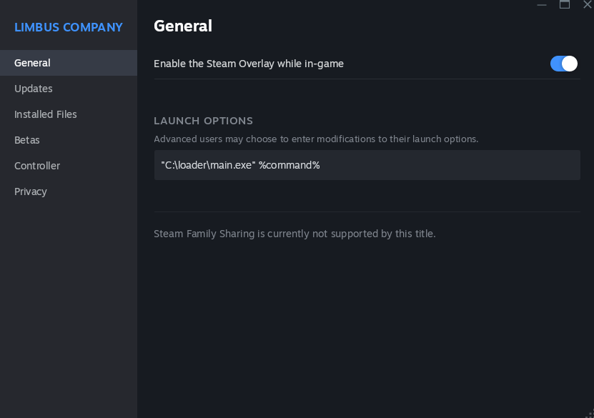

# Limbus Mod Loader

This is a mod loader for loading Limbus Company visual mods. 

## Discord Servers:
- Limbus Company Modding Discord: https://discord.gg/T4kpeNcnnc

Ping @zenocara for support.

## Download
Check the [release](https://github.com/LEAGUE-OF-NINE/LimbusModLoader/releases) page for the newest version, it is available as `build.zip`.

## Installation
Create a folder somewhere and download the modloader. Unzip the modloader in the new folder, it should create a `main.exe` and a folder `__internal`. 

Right click Limbus Company on Steam, click Properties, and in General there should be a text field for specifying launch option. Put `"path to main.exe" %command%` in the launch option.
For example, if your main.exe is at `C:\loader\main.exe`, put `"C:\loader\main.exe" %command%` in the launch option.

Now launch Limbus Company, the game should start as usual. at `AppData/Roaming`(accessible via `%APPDATA%`) there should be a new folder `LimbusCompanyMods`, with a `log.txt` inside it. To install visual mods, you can put the mod files in `LimbusCompanyMods`.

Currently, two types of mods are supported:

1. Lunartique format mods: Zip files containing installer and uninstaller scripts (`Installer.bat` and `Uninstaller.bat`). Simply put the zip files in the `LimbusCompanyMods` folder and it should load the mod upon launching (no need to unzip it!!).
1. Carra format mods: `.carra` files, designed to be more compact and easily distributable.

Lunartique format mods will be converted to Carra format mods when launching the game. 
